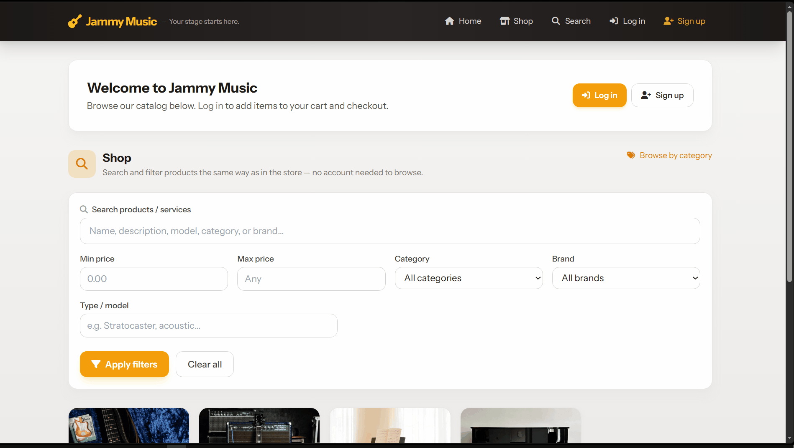
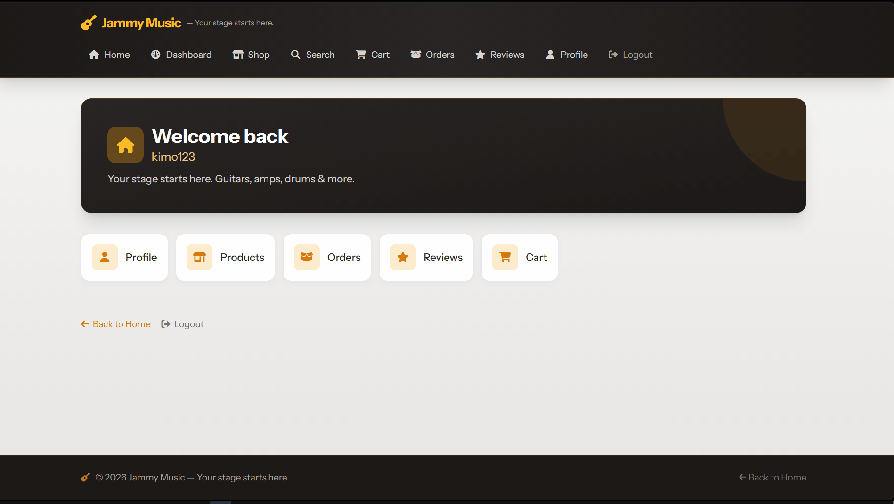
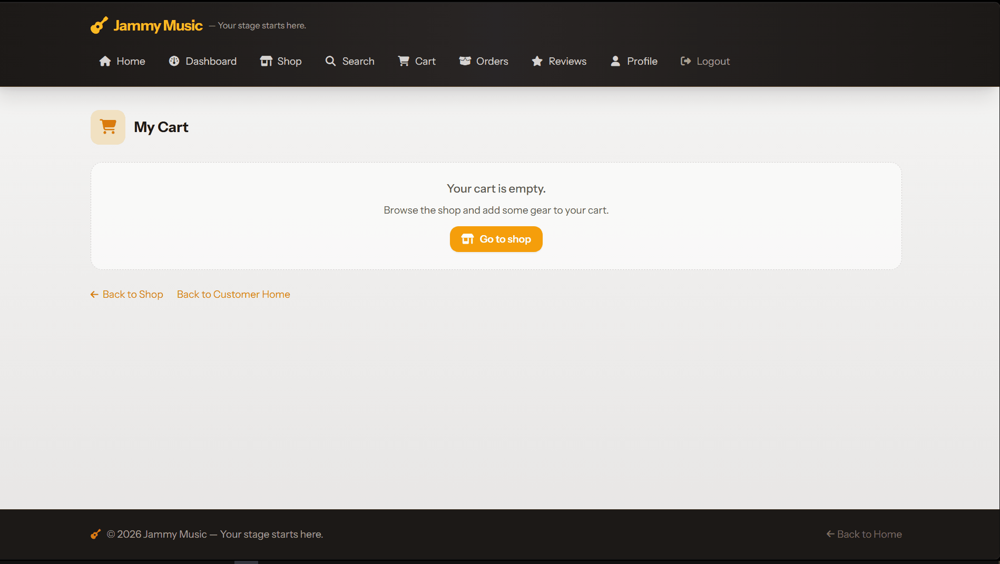
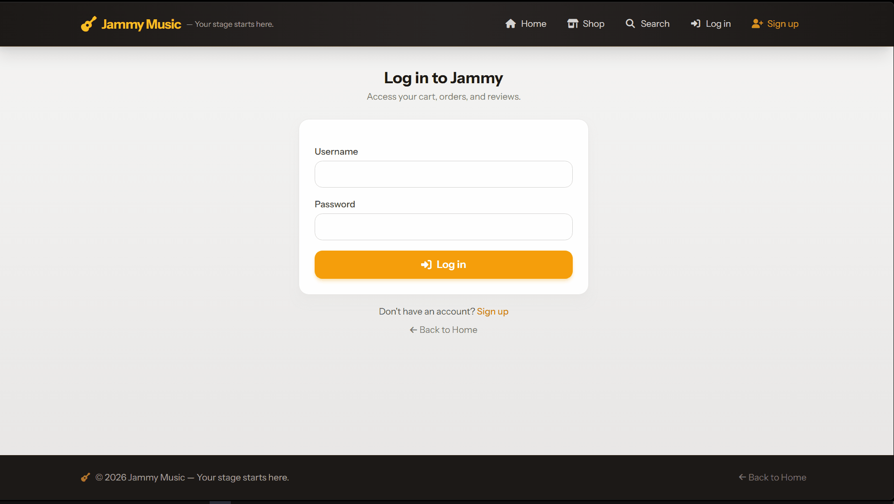
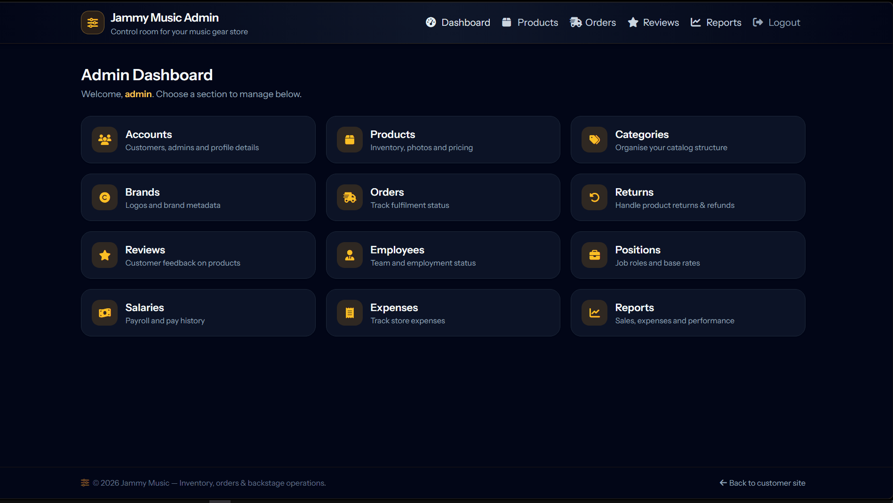

# Jammy 

A Laravel-based e‑commerce demo for a music gear store. Mostly focused on CRUD transactions and using dependencies for other features. It was made to support guests, customers, and admins.

<p align="center">
	
</p>

---

## Demo

### Customer side

Home page, search, filters, and browsing:



Browsing products and adding to cart:




Login, signup, and customer settings:




### Admin side

Admin dashboard, DataTables CRUD, and reports:




---

## Features

- **For Customer**
	- Home page product search (Laravel Scout + LIKE) with filters for price, category, brand, and type/model.
	- Category → brand → product browsing flow with a Tailwind layout.
	- Product detail page with photo carousel, verified ratings/reviews, and add‑to‑cart.
	- Cart with quantity controls, select‑to‑buy, and checkout to orders.
	- Customer profile, orders history, returns, and review management.

- **For Admin**
	- DataTables‑powered CRUD screens for products, brands, categories, accounts, orders, salaries, etc.
	- Soft‑deletes, batch actions (delete/restore/activate/deactivate) and login rules that prevent deleted/inactive accounts from signing in.
	- Product import from Excel/CSV using **maatwebsite/excel** (plus OpenSpout available for other spreadsheet use cases).
	- Sales reports with **ConsoleTVs/Charts** + Chart.js: yearly sales, date‑range bar chart, and sales‑by‑product pie chart.

- **For nerds**
	- Laravel 12 application used.
	- Tailwind CSS + Vite build.

---

## Dependencies

Key PHP / Laravel packages (from `composer.json`):

- `laravel/framework` – main Laravel 12 framework.
- `laravel/scout` – full‑text product search on the home page.
- `maatwebsite/excel` – Excel/CSV import for products.
- `openspout/openspout` – streaming spreadsheet support (for additional import/export flows).
- `consoletvs/charts` – chart wrapper used in admin sales reports.
- `dompdf/dompdf` – PDF generation.
- `yajra/laravel-datatables`, `yajra/laravel-datatables-oracle` – DataTables integration for admin CRUD pages.

Node / frontend tooling (from `package.json`):

- `vite` – dev server and build tool.
- `laravel-vite-plugin` – Laravel + Vite integration.
- `tailwindcss` and `@tailwindcss/vite` – utility‑first CSS and Vite plugin.
- `axios` – HTTP client used where needed for AJAX.
- `concurrently` – used in the Composer `dev` script to run PHP server, queues, logs, and Vite together.

---

## Installation & Setup

These steps assume PHP 8.2+, Composer, Node.js, and npm are installed.

1. **Clone the project**

	 ```bash
	 git clone &lt;your-repo-url&gt; jammy
	 cd jammy
	 ```

2. **Install PHP dependencies**

	 ```bash
	 composer install
	 ```

3. **Set up environment file & app key**

	 ```bash
	 cp .env.example .env   # or copy via your OS
	 php artisan key:generate
	 ```

	 Configure your database connection in `.env` (`DB_*` values).

4. **Run migrations (and seed if you have seeders)**

	 ```bash
	 php artisan migrate
	 # optionally
	 php artisan db:seed
	 ```

5. **Install Node dependencies & build assets**

	 ```bash
	 npm install
	 npm run build   # or: npm run dev for hot reload
	 ```

6. **Serve the application**

	 ```bash
	 php artisan serve
	 ```

	 Then open `http://localhost:8000` in your browser.

> Tip: There is also a convenience Composer script in `composer.json` that chains these steps:
>
> ```bash
> composer run setup
> ```

---

## Project Scripts

- **One‑time setup**

	```bash
	composer run setup
	```

- **Development mode (PHP server, queues, logs, Vite) – from `composer.json` `dev` script**

	```bash
	composer run dev
	```

- **Run tests**

	```bash
	composer test
	```

---

## Notes / To Be Improved

- Demo GIFs live in the `jammy-demo/` folder and the logo SVG is in `public/guitar-solid-full.svg`.
- This project was built against Requirements.txt from the course, including explicit use of Laravel Scout, maatwebsite/excel, and consoletvs/charts.
- I really wished I could've added a way for guests to still have an add-to-cart features. I saw a YouTuber that stored cart-products into an array, into a cookie (not exactly stored in the database, yet) then their cart is still there after sign up. It would've been cool, though I have no idea how to implement that confidently. 
